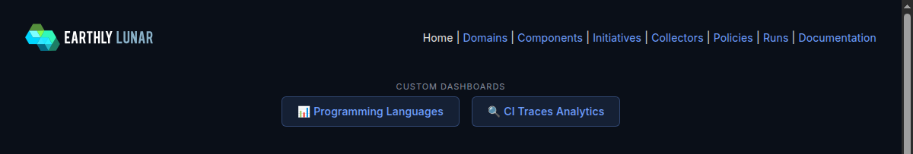
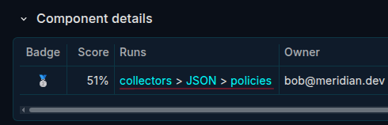

# Lunar Sandbox Environment

## Quick Access

| | |
|---|---|
| **Dashboard** | https://meridian.demo.earthly.dev |
| **Username** | `lunar` |
| **Password** | *(sent separately)* |
| **GitHub Org** | https://github.com/meridian-demo |
| **Docs** | https://docs-lunar.earthly.dev |

> **Note:** Email brandon@earthly.dev for access to all repos in the GitHub org.

---

## Overview

This is a sandbox environment for evaluating [Lunar](https://docs-lunar.earthly.dev) — a guardrails platform that monitors your CI pipelines and codebases to enforce engineering standards automatically. The sandbox is pre-configured with 17 component repos across Go, Java, Python, Node.js, Helm, and Kubernetes — representing a realistic engineering organization.

Lunar pulls data from your code repositories and CI pipelines via **collectors**, building a normalized JSON representation for each software component. This unified view makes it easy to apply **policies** (automated compliance checks), build analytics dashboards, or query your entire portfolio programmatically.

---

## The Lunar Repo

This repo ([`meridian-demo/lunar`](https://github.com/meridian-demo/lunar)) is the configuration entrypoint. Key files:

- **`lunar-config.yml`** — defines which collectors and policies you want to run. This is where you wire everything together.
- **`collectors/`** — local collectors specific to this environment (e.g., the `ant` collector)
- **`policies/`** — local policies (e.g., `ant/min-version` which checks that Ant >= 1.10.0)

Most of the collectors and policies come from Lunar's growing open-source library of 100+ guardrails. Local collectors and policies are for organization-specific needs that aren't covered by the library.

### Example: The Ant Collector & Policy

The `collectors/ant/` directory contains a CI collector that detects Apache Ant commands in CI and extracts the version. It's a great example of how to write a CI collector:

- **[`collectors/ant/lunar-collector.yml`](collectors/ant/lunar-collector.yml)** — declares the hook (`ci-after-command` on the `ant` binary)
- **[`collectors/ant/ant-cicd.sh`](collectors/ant/ant-cicd.sh)** — the collector script (~10 lines of bash). Runs `ant -version` and writes the result to a normalized field in Component JSON (`.lang.java.native.ant.cicd`), following the same schema conventions as all other language/tool collectors.

The matching policy in [`policies/ant/min-version.py`](policies/ant/min-version.py) reads that normalized data and checks if the Ant version meets a minimum threshold. Simple Python using the `lunar-policy` SDK.

---

## How It Works

### Collectors

Collectors gather metadata about your components. There are two types:

- **Code collectors** run as a centralized CI system managed by the platform team. On every push to the default branch (and PRs), they analyze source code in sandboxed containers — parsing `pom.xml` for dependencies, checking `Dockerfile` best practices, detecting language versions, etc. This runs independently of the component's own CI, so the platform team can add data collection logic without touching individual team workflows.

- **CI collectors** run inside the component's CI pipeline, triggered by the Lunar CI agent. The agent traces process execution and fires hooks when specific commands run (e.g., `go test`, `mvn build`, `docker build`). This captures runtime data like test coverage, build tool versions, and CI timing — without requiring any changes to the component's CI workflow. This demo environment uses GitHub Actions, but Lunar works similarly with Jenkins and other CI systems.

### Component JSON

All collected data flows into a **Component JSON** — a standardized, normalized JSON structure for each component. It normalizes data from hundreds of different tools, languages, CI systems, and integrations into a single queryable schema. This makes it straightforward to write policies that work across your entire portfolio regardless of the underlying technology stack, or to build dashboards that aggregate insights at scale.

### Policies

Policies evaluate the Component JSON and produce pass/fail assertions. They're written in Python (using the `lunar-policy` SDK), though OPA/Rego can also be used if you have existing policies there. For example:
- "Java version must be >= 17"
- "All repos must have a README"
- "Docker builds must use explicit tags"

Policies have enforcement levels that determine how results are communicated. Levels like `report-pr` and `block-pr` produce checks directly in the developer's PR — so they see what needs fixing before merge. Other levels include `score` (dashboard only) and `block-pr-and-release`. Check the open PRs on component repos to see this in action.

---

## Key Places in the Dashboard

Sign in at https://meridian.demo.earthly.dev. Navigate through the different links in the nav bar to explore the various components in the sandbox and the results of the collectors and policies across each of them.



A few things worth finding:

- **Custom dashboards** (linked at the top of the home page) — these were built specifically for topics that came up in our previous demos together. **Programming Languages** aggregates data from code collectors and CI agents to show languages, build tools, and versions across the full SDLC. **CI Traces Analytics** shows OpenTelemetry traces of complete CI process trees.

- **Component detail page** — click any component, then look for the **collectors > JSON > policies** links to see collector run history, the normalized Component JSON, and policy results:



---

## PR Feedback in Action

Open PRs exist on several component repos. Visit them to see how Lunar communicates policy results to developers. Enforcement levels like `report-pr` and `block-pr` produce checks directly in the PR, so developers (or AI agents) can see what needs fixing and address it during their normal workflow.

---

## Local Development

You can develop and test code collectors and policies locally using the Lunar CLI. Code collectors and policies run inside containers, which means if it works locally, it works when you deploy it to the hub — no environment-specific surprises. (CI collectors run natively on the CI runner and are best tested in a real CI environment — local dev can't replicate the process tracing that happens in a live pipeline.)

### Install the CLI

Download the latest binary from the [Lunar releases page](https://github.com/earthly/lunar-dist/releases), then:

```bash
chmod +x lunar-* && mkdir -p ~/.lunar/bin && mv ./lunar-* ~/.lunar/bin/lunar
export PATH="$HOME/.lunar/bin:$PATH"
```

Docker is required for local dev commands (collectors and policies run inside containers).

### Test a Code Collector

```bash
# From this repo's directory
export LUNAR_HUB_TOKEN=<sent-separately>

# Run the Java project collector against the inventory component
lunar collector dev java.project \
  --component github.com/meridian-demo/inventory
```

### Test a Policy

```bash
# From this repo's directory
export LUNAR_HUB_TOKEN=<sent-separately>

# Check if inventory meets the minimum Java version requirement
lunar policy dev java.min-version \
  --component github.com/meridian-demo/inventory
```

---

## It's All Yours

This is a test playground — anything can be fixed or reverted if broken. Feel free to:

- **Edit `lunar-config.yml`** and commit straight to main — add components, modify or create your own collectors and policies, etc.
- **Push commits** to component repos to trigger collectors and see results
- **Open PRs** on component repos to see policy feedback in action
- **Add your own repos** to the GitHub org and register them as components
- **Write your own collectors and policies** — use the ant example as a starting point
- **Break things** — we can always reset!

Have fun, and reach out to brandon@earthly.dev with any questions.
